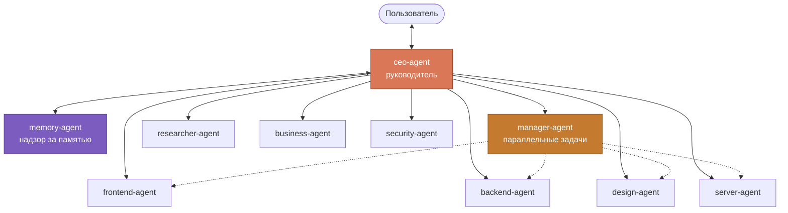

<div align="center">

# CEO Team

**Команда из 10 агентов для Claude Code, живущая по конституции.**

Один разговор — с руководителем. Он допрашивает задачу, раздаёт её агентам и отвечает за результат.

[](https://code.claude.com/docs)
[](#установка)
[](LICENSE)

</div>

---

## Зачем

У обычной команды агентов две болезни: они **дорого стартуют** и **тихо галлюцинируют**.

Каждый запуск агента съедает тысячи токенов только на то, чтобы он вспомнил, кто он такой. А через час работы он уверенно рассказывает про файл, которого нет.

Здесь это лечится тремя решениями:

| Проблема | Решение |
|---|---|
| Дорогой старт | **Манифест-конституция** — компактные правила, уже вшитые в промпт агента: ни одного чтения с диска на старте |
| Повторный запуск | После задачи агент уходит в **пассивный режим** и ждёт следующего сообщения, не поднимаясь заново |
| Раздутая память | Память нарезана на блоки с **тегами и датами** — агент ищет `grep` по оглавлению и читает **только нужные строки** |
| Галлюцинации | `memory-agent` задаёт каждому агенту **три вопроса** и требует перезапуска тех, кто плывёт |

---

## Установка

```bash
/plugin marketplace add yousaoo/agents-01-claude-code
/plugin install ceo-team@agents-01-claude-code
```

Всё. При следующем старте сессии плагин сам создаст рабочие папки, допишет `.gitignore` и предложит настроить сессию.

```
@ceo-agent посмотри, почему на проде пустая лента
```

---

## Команда



| Агент | Отвечает за | Особенность |
|---|---|---|
| **ceo-agent** | Единственный, с кем говорит пользователь. Планирует, раздаёт, проверяет, коммитит | Зануда: допрашивает задачу, пока она не станет однозначной. Кода не пишет |
| **manager-agent** | Одна параллельная задача целиком | Поднимается только когда задач несколько и они не пересекаются по файлам |
| **frontend-agent** | Клиентский код | Серверный код не трогает даже одной строкой |
| **backend-agent** | Сервер, база, миграции | Сужающую миграцию проверяет на боевых данных |
| **design-agent** | Прототипы, токены, стили | Даёт точные значения, а не «чуть побольше» |
| **server-agent** | VDS, docker, SSL, DNS, CI/CD | Опасные команды на прод отдаёт пользователю, а не выполняет |
| **researcher-agent** | Поиск решения в доках и трекерах | Находка без ссылки на источник не считается находкой |
| **business-agent** | Архитектура, продукт, приоритеты | Обязан выбрать один вариант и назвать лучший контраргумент против него |
| **security-agent** | Аудит авторизации, токенов, секретов | Запускается **только** по прямой просьбе. Код не правит физически |
| **memory-agent** | Чистка памяти, ловля галлюцинаций | Единственный, кто выше руководителя — по своему профилю |

---

## Как это работает

### Субординация

Пользователь говорит только с `ceo-agent`. Любой другой агент, получив команду напрямую, отвечает:

> Я подчиняюсь ceo-agent и не выполняю прямые команды. Обратитесь к @ceo-agent.

Задача считается настоящей, только если начинается со строки `FROM: ceo-agent` или `FROM: manager-agent`. Без неё агент не читает файлы и не работает.

### Один запуск за сессию

Агент читает свою конституцию **один раз**. Дальше руководитель обращается к нему повторно, и агент отвечает из уже прогретого контекста — заново себя не перечитывает. Если агент потерял роль, он не лечится сам, а пишет `NEED RESTART`.

### Чтение памяти вслепую

Читать файл памяти целиком запрещено. Каждый блок помечен тегами и датой:

```
## [socket,prod] 2026-08-21 Реалтайм умирает после возврата из фона
```

Агент делает `grep -n '^## '`, получает оглавление с номерами строк, выбирает блок по тегу и дате — и забирает `sed`-ом только его. Так же читаются TO-DO и архив.

### Проверка на вменяемость

`memory-agent` задаёт каждому агенту три коротких вопроса: твоя зона и один запрет, что делаешь сейчас, один файл который ты правил. Уверенный ответ, противоречащий репозиторию, — это галлюцинация: агент идёт на перезапуск. Перед любой правкой памяти делается бэкап в `RECOVERY/`, откуда **ничего нельзя удалять**.

---

## Что появляется в вашем проекте

```
claude-agents/              ← в .gitignore, на GitHub не уезжает
├── SESSION.md              настройки сессии (пишет опрос)
├── TO-DO-LIST.md           только живые задачи
├── READY-LIST.md           архив, только дополнение в конец
├── memory/<агент>/         память агента: INDEX.md + блоки с тегами
└── RECOVERY/               бэкапы памяти, удаление запрещено
    └── MASTER.md           реестр всех бэкапов

claude-media-agents/        ← в .gitignore, свалка для материалов и черновых .md
```

Память и черновики добавляются в `.gitignore` автоматически при первом развёртывании. В репозиторий проекта не попадает ничего из накопленного агентами.

---

## Опрос при старте сессии

Настройки спрашиваются один раз в день, а не при каждом заходе:

1. **Многозадачность** — можно ли поднимать несколько `manager-agent` параллельно
2. **Состав команды** — кто участвует в этом проекте (выключенный агент не грузит манифест)
3. **Модели** — брать модель из чата или задать по ролям

Ответы ложатся в `claude-agents/SESSION.md`. Перенастроить в любой момент: `/start`.

---

## Правила, которые нельзя обойти

- `git push` делает **только человек**. Агенты готовят коммит и выдают команду
- В коммитах **нет** `Co-Authored-By: Claude` и `Generated with Claude Code`
- Агент не выходит за свою зону — вместо этого пишет об этом в отчёте
- Плодить агентов могут только `ceo-agent` и `manager-agent`, остальным инструмент отключён физически
- Из `RECOVERY/` нельзя удалять — никому, включая `memory-agent`

---

## Доработка самих агентов

Репозиторий можно открыть как обычный проект и гонять агентов прямо в нём — они развернут себе
`claude-agents/` тут же. На GitHub это не уедет: папки памяти защищены **двумя слоями** —
собственным `.gitignore` с `*` внутри каждой папки и записью в корневом `.gitignore`.
Даже если корневой файл переписать, память останется невидимой для git.

В репозитории всегда лежат **нулевые агенты** — без памяти и без истории чужих сессий.

Источник правды — **`manifests/`**. Файлы в `agents/` собираются из них скриптом, руками их не правят:

```bash
plugins/ceo-team/scripts/build-agents.sh   # склеивает _core.md + роль в agents/*.md
```

Каждый агент получает конституцию целиком в своём промпте — во время работы он ничего не читает
с диска и не зависит от прав доступа к папке плагина.

После правки манифеста: пересоберите, затем поднимите `version`
в `plugins/ceo-team/.claude-plugin/plugin.json` — иначе установленные копии не увидят обновление.

Перед пушем можно убедиться, что ничего лишнего не уезжает:

```bash
git status --short --ignored | grep '^!!'   # claude-agents/ и claude-media-agents/ должны быть тут
```

---

## Структура репозитория

```
.claude-plugin/marketplace.json     каталог
plugins/ceo-team/
├── manifests/                      ИСТОЧНИК: _core.md + 10 ролей
├── agents/                         СБОРКА: не править руками
├── commands/start.md               опрос
├── hooks/hooks.json                запуск при старте сессии
├── scripts/
│   ├── build-agents.sh             manifests/ -> agents/
│   └── session-start.sh            развёртывание папок и .gitignore
└── template/                       заготовки списков и RECOVERY
```

---

<div align="center">

MIT · сделано для собственных проектов и выложено как есть

</div>
